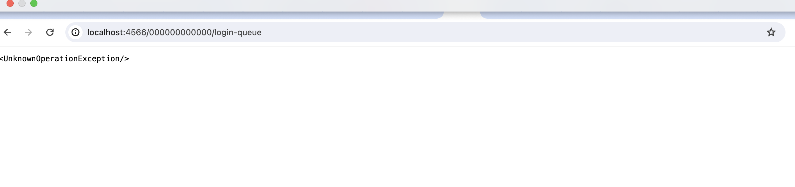
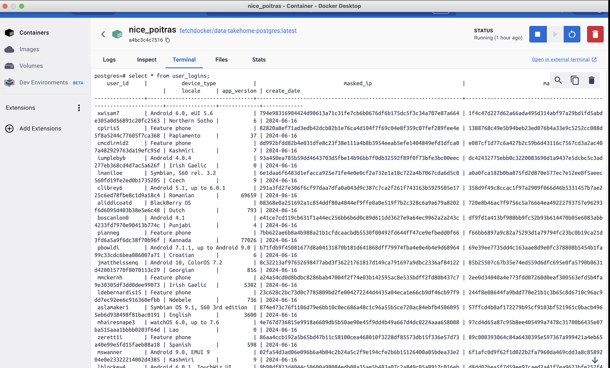

# Data Engineering Take Home: ETL off a SQS Queue 
## Welcome 
**Hey there, data enthusiasts!**

I'm Muskan Kachhela, a recent grad with a shiny new **Master of Science in Information Technology** from Arizona State University. (Go Sun Devils!)

As an aspiring data engineer, I'm fascinated by the power of data and its impact on the world. My internships, coursework, and projects have been a wild ride of exploration, equipping me with skills in languages like Python, SQL, Java, and R.

But that's not all! I'm also comfortable wrangling tools like Kafka, Spark, Airflow, Hive, Hadoop, Azure, AWS, Docker, Kubernetes, and a whole Git-ful of others (think Tableau, Databricks, etc.).

This Data Engineering project from **Fetch** is one of the coolest adventures I've embarked on! It's a fantastic opportunity to hone my skills and add another awesome project to my repertoire. Woohoo!

Thanks, Fetch, for giving me this chance to dive deeper into the world of data!
## The Objective of the Project <br />
This challenge will focus on your ability to write a small application that can read from an AWS
SQS Queue, transform that data, then write to a Postgres database. This project includes steps
for using docker to run all the components locally, you do not need an AWS account to do
this take home.<br />
<br />1. To read JSON data containing user login behavior from an AWS SQS Queue, that is made
available via a custom localstack image that has the data pre loaded.<br />
2. Fetch wants to hide personal identifiable information (PII). The fields `device_id` and `ip`
should be masked, but in a way where it is easy for data analysts to identify duplicate
values in those fields.<br />
3. Once you have flattened the JSON data object and masked those two fields, write each
record to a Postgres database that is made available via a custom postgres image that
has the tables pre-created.

## Challenges Encountered: LocalStack Container Issues with AWS SQS Interaction 
During my implementation of the task, I faced significant challenges with the LocalStack container, particularly in its interaction with AWS SQS:

**Persistent Operational Issues:** 
The LocalStack container consistently encountered operational issues specifically related to AWS SQS emulation. It threw an UnknownOperationException error, which prevented me from effectively using LocalStack to simulate SQS queues locally. 



**Impact on Development:**
This issue hindered my development workflow. Since I couldn't rely on LocalStack to emulate SQS queues as intended, I could not proceed with reading messages from the queue, transforming the data, and subsequently inserting it into the Postgres database—all critical components of the assigned task.

**Alternative Approach Adopted:** 

To circumvent the LocalStack limitation and continue development:

**Direct AWS SQS Usage:** I opted to create a workaround by using a personal AWS SQS queue instead of LocalStack. This involved preparing a dummy CSV file containing mock data, which I then uploaded to the AWS SQS queue.

**AWS SDK Integration:** Leveraging AWS SDKs (like boto3 in Python), I retrieved messages from the AWS SQS queue and processed them accordingly. This approach enabled me to proceed with data transformation and database insertion despite the initial setback with LocalStack.

## Project Setup.
First things first: Install the following on your system -

1. Docker ```https://docs.docker.com/get-docker/```
2. Postgres psql ```https://www.postgresql.org/download/```
3. AWS CLI ```console pip install awscli-local[ver1]```

## How to run the code ?
 

  <br><br>
  
  <p>1. To run this code, you need to clone this repository or download it to your local machine, and then you can run it using IntelliJ, Visual Studio Code, or any other IDE.</p>
  <p>2. The easiest way is to clone this repository and run the command:</p>
  <pre><code>cd Fetch-Rewards-Assessment-Main</code></pre>
  <p>3. Next, you need to run this command to start the Docker containers:</p>
  <pre><code>docker-compose up -d</code></pre>

<br /><b>Congratulations! The project is now running and all set to test!🚀 </b>

## Testing the project.

To read a message from the queue using awslocal, run the following command : 
<pre><code> awslocal sqs receive-message --queue-url https://sqs.us-east-1.amazonaws.com/232572834960/my_queue </code></pre>

If localstack container is used for testing the queue, use the following command instead :

<pre><code> awslocal sqs receive-message --queue-url http://localhost:4566/000000000000/login-queue </code></pre> 

To connect to the Postgres database and verify the table is created, in the docker container terminal, run the following command : 
<pre><code>psql -d postgres -U postgres -p 5432 -h localhost -W </code></pre>

Next, try to run the following query:
  <pre><code>select * from user_logins;</code></pre> 

  This query should display the user_logins table.

## Solution Development Decisions

**● How will you read messages from the queue?**

`Boto3` is used in this script to interact with AWS SQS. It creates an SQS client to:

Retrieve messages from the queue (using receive_sqs_messages).
Delete messages from the queue (using delete_sqs_message).
It also leverages environment variables for secure credential handling.

**● What type of data structures should be used?**

Dictionary: Best for storing user data extracted from messages (key-value pairs for user attributes like "user_id", "masked_ip").

**● How will you mask the PII data so that duplicate values can be identified?**

The script uses SHA-256 hashing to mask PII data. This one-way hashing function creates a unique fingerprint for each data point (e.g., IP address) without revealing the original value. By comparing these hashes, the script can efficiently identify duplicates while protecting user privacy.

**●What will be your strategy for connecting and writing to Postgres?**
The script uses `psycopg2` to connect to Postgres, leveraging implicit connection pooling for efficiency. The `insert_data` function utilizes formatted strings for queries. Error handling is included to catch and log any issues during data insertion. Transactions are committed for data consistency. 

**●Where and how will your application run?**

This Python application is designed for a cloud environment and interacts with an AWS SQS queue. It acts as a backend service, triggered by new messages. Upon receiving a message, it extracts user data, masks PII with hashing, and stores the data securely in a Postgres database.

## Answers to the assignment questions:

<b>● How would you deploy this application in production?</b><br/ >
<br/ >
 :rocket: 
To deploy this application in production, I followed a structured approach:

**Containerization:** I used Docker to package the application and its dependencies into a container, ensuring consistency across environments.

**Environment Configuration:** Securely managed AWS credentials and SQS queue URL through environment variables.

**Database Connectivity:** Configured PostgreSQL connection details directly in the application code.

**Deployment Process:** After configuring the environment and ensuring database connectivity, I ran the application within the Docker environment. This involved executing the Docker container for PostgreSQL.

**Testing and Validation:** Conducted thorough testing in a staging environment to verify functionality, including SQS message processing and database operations.

**Documentation:** Updated README.md to provide clear instructions for building the configuring environment variables, running the application, and potential Docker Compose usage.

<b>● What other components would you want to add to make this production-ready?</b>

<b>CI/CD Pipelines for Automation:</b> Implement CI/CD pipelines to automate testing, building, and deployment processes, ensuring rapid and reliable delivery of updates.

<b>Logging and Monitoring with ELK Stack:</b> Centralize logging with ELK stack for comprehensive monitoring and analysis of application performance, enabling proactive troubleshooting and optimization.

<b>Security Measures and Disaster Recovery:</b> Enforce robust security measures, including encryption and role-based access control, while establishing disaster recovery plans to mitigate risks and ensure data integrity.

**Error Handling:** Set up alerts and notifications for critical errors or anomalies detected in the application or infrastructure components.

<b>● How can this application scale with a growing dataset?</b>

:rocket: Utilizing Kubernetes' auto-scaling capabilities, coupled with Apache Spark's distributed computing power, and leveraging cloud infrastructure for elastic resource provisioning, our application seamlessly accommodates the expansion of our dataset, ensuring optimal performance and scalability.

● How can PII be recovered later on?

The application uses SHA-256, a one-way hashing function, to mask PII-like device IDs and IP addresses which means the application masks certain PII fields like IP addresses and device IDs before storing them. Masking replaces the original data with a hash value, making it not possible to reverse the process and retrieve the original information.

**Securely Store Original Values:** Encrypting the original IP addresses and device IDs before storing them alongside the hashed values. This allows retrieval with proper authorization but adds complexity and security risks.

**Maintain a Mapping Table:** Creating a separate secure table linking original PII to their hashed counterparts. This offers simpler management but requires careful control of the table to prevent unauthorized access.

● What are the assumptions you made?
 
**Local Development Environment:** Given the issues with the LocalStack container, I assumed that creating and using a personal AWS SQS queue for development and testing was acceptable. This allowed me to proceed with the task despite the initial environment setup challenges.

**Data Structure:** I assumed that the input data format from the AWS SQS queue would remain consistent, as provided in the CSV file and outlined in the task description. This allowed me to design the data transformation and masking processes based on a fixed schema.

**Error Handling:** I assumed that logging errors and storing error records in a PostgreSQL table would be sufficient for tracking and debugging issues during the ETL process. This approach provided a straightforward way to monitor and handle errors.

**Processing Latency:** I assumed that a slight delay (10 seconds) in polling the SQS queue when no messages are available would be acceptable for this task. This balance between responsiveness and resource usage was deemed appropriate for the given requirements.

## Processed Queue Items in the Database

